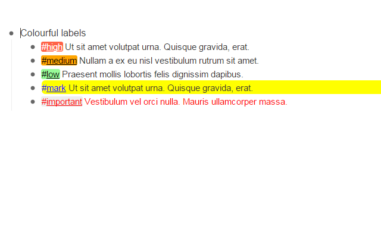

# Colourful labels for Workflowy

This is a chrome extension that allows you to add colour to workfloy lists.
You can do this by assigning a colour to each label. Actually you have more control,
such as changing text colour or background colour and choosing whether to apply the
colours to the labels or to the while task.

The result is something like this:

## Licence
This application is open source software and is available under [GPL v3.0](http://spdx.org/licenses/GPL-3.0+)

Please also look at the LICENCE file in the project route
